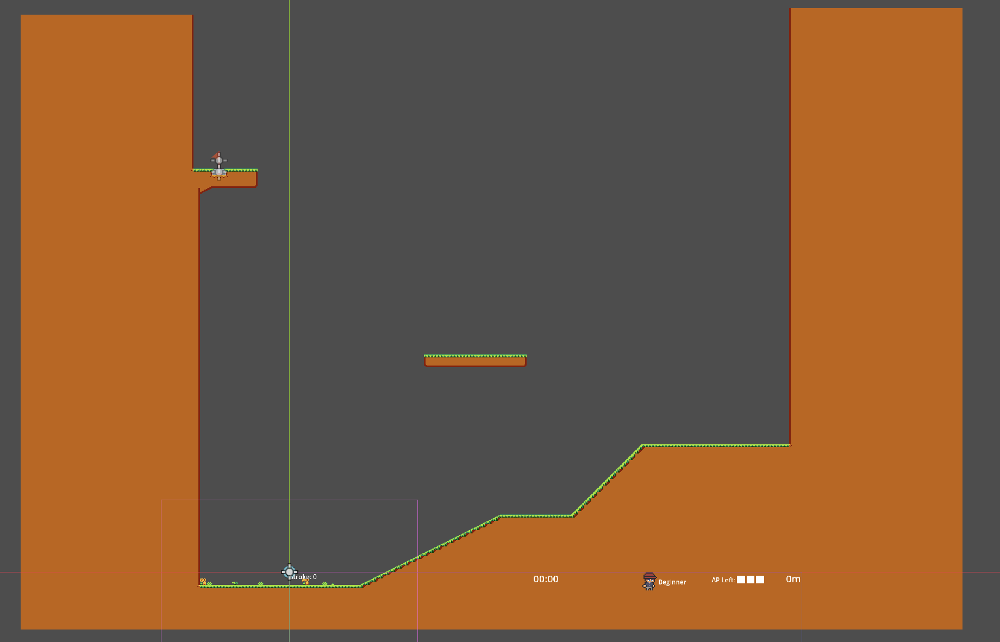
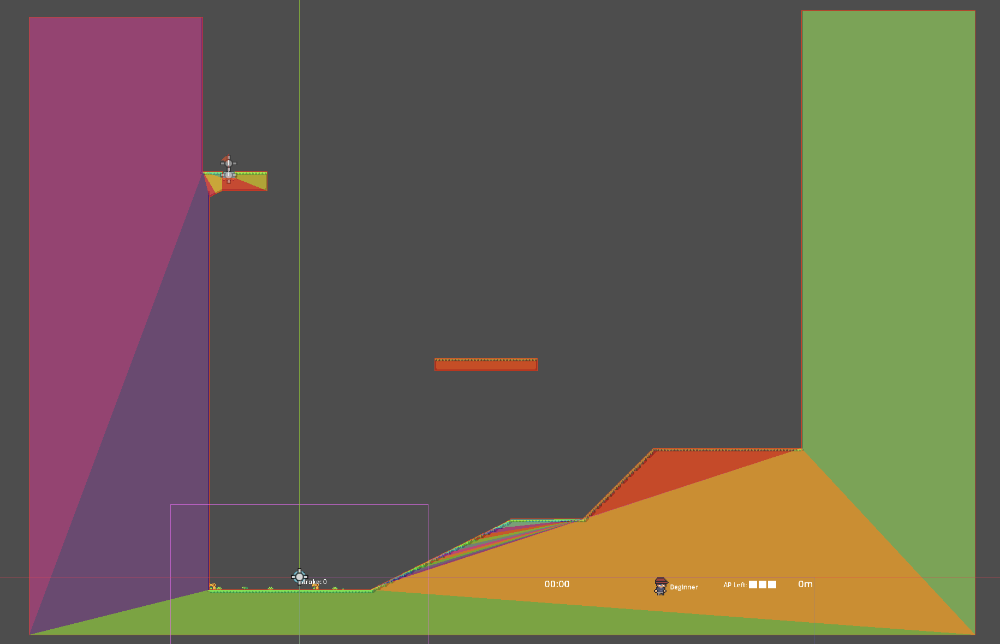
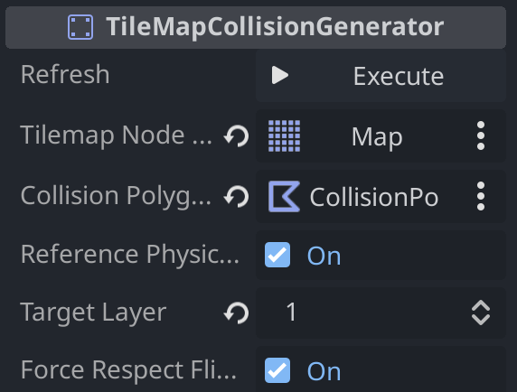

# TileMapColliderGenerator

This plugin will generate a set of ColliderPolygon2D to overlap all physics properties of a Tilemap2D's target layer.

### Requirements
There are two requirements for this plugin to work properly:

1. You need to have a TileMap within your scene.
2. You need to have a physics layer defined on your tiles if you want non-square colliders.

### Setup

In order to use the TileMapColliderGenerator, you simply need to:

1. Add the plugin to your project
2. Create a TileMapColliderGenerator node in your scene
3. Link the `TileMap` to the TileMap that is within your scene
4. Configure the settings for the generator
5. Click execute

### Settings

#### TileMapNodePath (required)

This exported field is the **only** required field to be set. The TileMapColliderGenerator will use this TileMap to generate the CollisionPolygon2D(s) based on the tiles that are set within your scene as part of the linked TileMap.

#### CollisionPolyonNodePath (optional)

This exported field can be set to a CollisionPolygon2D as a **child** of the TileMapColliderGenerator. While it may still work if it's not a child, it should be set as a child in order to guarantee it works properly.

If this field is unset, when `Execute` is pressed, a CollisionPolygon2D will be generated for each separate polygon that is found.

> Note: If your TileMap has islands (tiles that are not connected to the main 'level'), you should not set this field.

#### ReferencePhysicsMaterial (optional - default true)

This exported field can be enabled or disabled (enabled by default). When set to true, the generated colliders will respect the physics colliders set for each of the tiles. When set to false, all tiles will be treated as a square when creating the collision polygon.

#### TargetLayer (optional - default 0)

This exported field allows you to specify the layer of the TileMap that you would like to create the CollisionPolygon2D for.

#### ForceRespectFlippedTilesPhysics (optional - default true)

When set to true, this exported field will respect the orientation of the tile that was set. As an example, if a tile has only the right 50% of the tile configured for the physics layer, and that tile is drawn on the screen but flipped horizontally, the horizontally flipped tile's collision will now be on the left 50% of the tile. By default when searching through the TileMap for a given cell within your scene, Godot does not return this respecting that tile's flipped state. Given this, I've added the ability to respect that by default. However, if this is a bug on the Godot side and Godot fixes this, all you would need to do is flip this boolean to false and it will just treat the returned collision as the source of truth.

#### Things to Note:

##### If you are running into issues where corners of your tilemap still are colliding, disbale the physics layer or move the collision for it to a different layer after generating the collision polygons.

##### If you are transforming shapes when drawing them, try not to rotate the tiles (z - rotate left, x - rotate right), only flip the tiles using (c - horizontal, v - vertical). You can achieve the same orientation through flipping only. The reason this is required is because the positioning of the tile is not saved when it's transposed. So it's not possible (from what I can tell) to determine it's position accurately if rotations were used.

#### Special thanks to github.com/AFK-Mario for initially writing the code to generate the set of polygons [here](https://gist.github.com/afk-mario/15b5855ccce145516d1b458acfe29a28).

#### Happy Coding! <3
